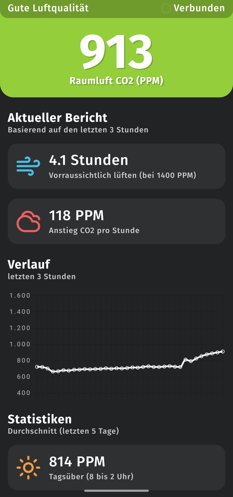

# tfa-co2-smarthome

App for the TFA AIRCO2NTROL MINI CO2 air quality sensor (https://www.tfa-dostmann.de/produkt/co2-monitor-airco2ntrol-mini-31-5006/).
This is usually not a smarthome enabled device, but through the usb power port you can read the data from it.

I wanted to have digital access to the device sensor readings so I built this as a simple docker container to host on any computer the device is plugged in to.

The API also enables it to be integrated into HomeAssistant.

## Features
- Beautiful Web-UI
- PPM per hour and window opening estimation
- Realtime API with Server Sent Events

Screenshot:

